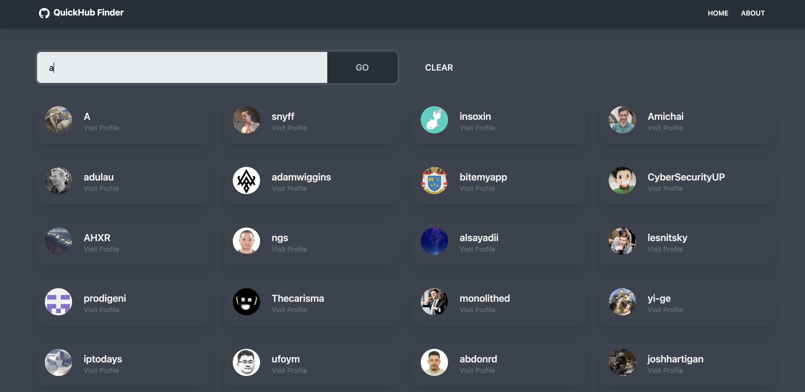

# Github Finder app

This app allows you to search and view a GitHub user profile.

Live Demo : [Click Here](https://quickhub-finder.vercel.app/)

## What was used in this React project?

- TailwindCSS
- DaisyUI (Themes for creating components)
- Create React App
- Axios
- React Icons
- React Router
- React Hooks : useState, useContext, useReducer

## Preview




## Cloning and getting into the folder

```
git clone https://github.com/lhpellizzon/github-finder.git
cd github-finder
```

## Installing and Start the project

```
npm install
npm start
```

Happy Coding =)
